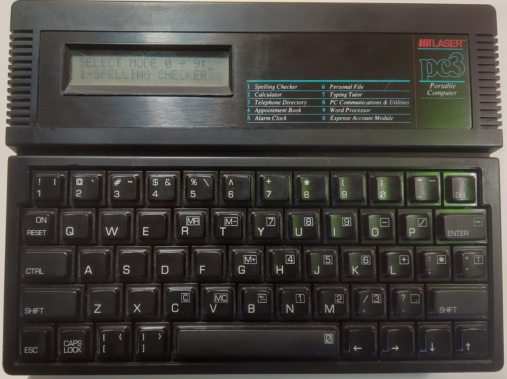
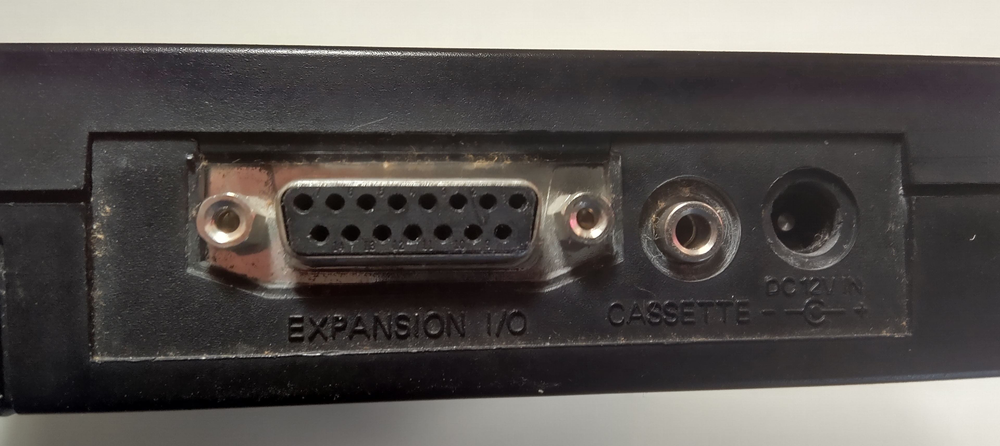

# Communications Program for Compumate (Vtech pc3)
 
The vtech Compumate (LASER) pc3 was a mid-side "notebook" style PDA made in the late 1980s. It has a full size keyboard, multiple built-in programs, and the ability to save data out a serial port.

The Communications Program for Compumate can download data from a Compumate LASER pc3 device. It may also work with other Compumate devices.

The Compumate is [menu driven](CompumateMenus.md); the list of programs is on the front. There's a complete [help system](CompumateHelp.md) which has been transcribed.

## Hardware Details

The Compumate uses a 2-line by 20 character LCD display; there's no backlight (or front light, either), which means you must be in a lit room to use the device. It's powered with 4 **AA** cells or with a 12-volt plug-in power supply.

The IO ports

The back of the device has a 15-pin port which can either be connected to a parallel port using a proprietary cable, or to a serial port with a different 15-bin to 25-pin propriatary cable. It can also connect to a cassette deck, and the data saved to a cassette or loaded back on.
